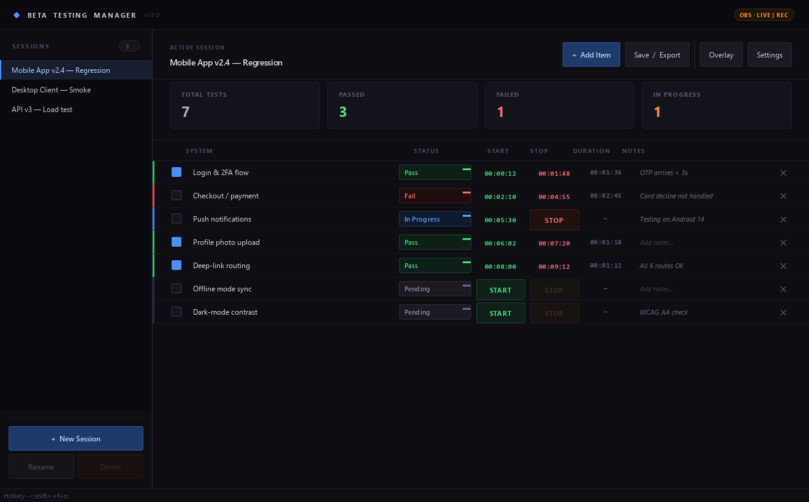
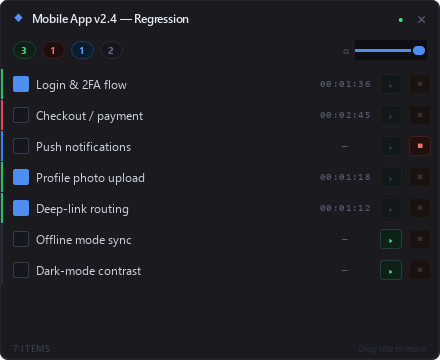
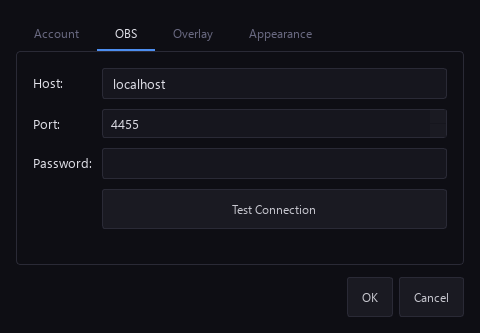

# Beta Testing Manager

A lightweight, dark-themed Windows 11 desktop app for beta testers. Manage test lists, log OBS timestamps, and overlay everything on top of any app — no alt-tabbing required.

---

## Screenshots



<table>
  <tr>
    <td width="50%" valign="top">
      <br/>
      <sub><b>Always-on-top overlay</b> — track tests over any app, draggable & adjustable opacity.</sub>
    </td>
    <td width="50%" valign="top">
      <br/>
      <sub><b>Settings</b> — connect to OBS, configure Supabase sync, customise the hotkey.</sub>
    </td>
  </tr>
</table>

---

## Prerequisites

| Requirement | Version |
|---|---|
| Python | 3.11 or newer |
| OBS Studio | 28+ (WebSocket v5 built-in) |
| Supabase account | Optional — enables cloud sync |

---

## Installation

```bash
# 1. Clone / copy the project folder
cd "Beta Testing App"

# 2. Create a virtual environment
python -m venv venv
venv\Scripts\activate

# 3. Install dependencies
pip install -r requirements.txt
```

---

## Supabase Setup (optional but recommended)

1. Create a free project at [supabase.com](https://supabase.com).
2. Open **SQL Editor → New Query**, paste the contents of `supabase_schema.sql`, and run it.
3. Go to **Project Settings → API** and copy your **Project URL** and **anon public** key.
4. Enter these in the app during first-run onboarding or in **Settings → Account**.

> `config.json` stores credentials locally in plaintext. Do **not** commit this file to version control.

---

## OBS Setup

1. In OBS: **Tools → WebSocket Server Settings**.
2. Check **Enable WebSocket server**.
3. Set a port (default: `4455`) and a password.
4. Click **OK**.
5. Enter the same host/port/password in **Settings → OBS** inside the app.

---

## First Run

```bash
python main.py
```

1. You will be prompted to enter a **username** — this tags all your sessions and CSVs.
2. Optionally configure Supabase credentials.
3. The main window opens. Configure OBS in **Settings → OBS**.

---

## Creating a Test Session

1. Click **New** in the left sidebar and give the session a name.
2. Click **+ Add Item** in the toolbar and name each system under test.
3. For each item you can:
   - Tick the **checkbox** to mark it as Pass.
   - Choose a **status** (Pending / In Progress / Pass / Fail).
   - Press **▶ Start** to capture the OBS timecode (or wall-clock if OBS is idle).
   - Press **■ Stop** to capture the end timecode.
   - Type **notes** inline (bug descriptions, observations).

---

## OBS Integration

- The app polls OBS every second. When streaming or recording, **Start / Stop** buttons capture the OBS timer (e.g. `00:12:34.500`).
- If OBS is not connected, timestamps fall back to the local wall-clock (`ISO-8601`).
- The OBS status indicator in the toolbar shows: `Connected (idle)` / `LIVE` / `REC` / `Disconnected`.

---

## Overlay

Toggle the floating overlay with the hotkey (default: `Ctrl+Shift+O`).

- The overlay floats above all normal windows and windowed-fullscreen (borderless) apps.
- Drag it anywhere on screen. Resize by dragging the edges.
- Adjust opacity with the `α` slider in the overlay title bar.
- Changes sync with the main window in real time.

> **Limitation:** The overlay cannot appear above **exclusive-fullscreen** DirectX swap chains (true fullscreen games). Switch those apps to windowed or borderless-windowed mode.

---

## Saving & Exporting

Click **💾 Save & Export** at any time.

- Data is saved to Supabase (if configured).
- A CSV is exported. You'll be prompted to choose a save location.

**CSV columns:** System Name, Status, Start Timestamp, Stop Timestamp, Duration, Notes, Tester, Date.

**Filename format:** `username_sessionname_YYYYMMDD.csv`

---

## Hotkey Customisation

In **Settings → Overlay**, edit the hotkey field using pynput format:

| Key combination | pynput format |
|---|---|
| Ctrl+Shift+O | `<ctrl>+<shift>+o` |
| Ctrl+F1 | `<ctrl>+<f1>` |
| Alt+F2 | `<alt>+<f2>` |

Restart the hotkey by saving settings.

---

## Settings Reference

| Setting | Description |
|---|---|
| Username | Your tester identity tag |
| Supabase URL | Project API URL from Supabase dashboard |
| Anon Key | Supabase anon/public API key |
| OBS Host | IP or hostname of OBS machine (default: `localhost`) |
| OBS Port | WebSocket port (default: `4455`) |
| OBS Password | Password set in OBS WebSocket settings |
| Overlay Hotkey | Global hotkey to toggle the overlay (pynput format) |
| Overlay Opacity | Transparency of the overlay window (20%–100%) |

---

## Architecture

```
main.py
└── MainWindow
    ├── SessionController  ←→  SupabaseService (supabase-py)
    ├── OBSController      ←→  OBSWorker (QThread) ←→ OBS via obsws_python
    ├── TestListWidget → TestItemRow (×N)
    └── OverlayWindow → OverlayItemRow (×N)
```

**Key design choices:**
- **PyQt6** — native Windows feel, low RAM (~55–80 MB idle), mature Qt ecosystem.
- **MVC separation** — views never touch models directly; all state lives in controllers.
- **QThread + signals** — OBS polling is entirely off the main thread; cross-thread communication is always via `pyqtSignal`.
- **pynput GlobalHotKeys** — OS-level hook so the hotkey fires even when the app is minimised.
- **Supabase anon key** — no auth server needed for a desktop app; RLS policies allow full access via the anon key.
- **Offline-first** — every Supabase call is wrapped in try/except; the app works without internet (local-only mode).

---

## Troubleshooting

| Problem | Fix |
|---|---|
| `ModuleNotFoundError: obsws_python` | Run `pip install obs-websocket-py` |
| OBS shows "Error" | Check host/port/password in Settings → OBS; verify WebSocket is enabled in OBS |
| Hotkey not firing | Check that the pynput format is correct; some antivirus blocks keyboard hooks |
| Supabase not syncing | Check your URL and anon key in Settings → Account; verify the SQL schema was applied |
| Overlay behind windows | Ensure you're not in exclusive-fullscreen mode |
